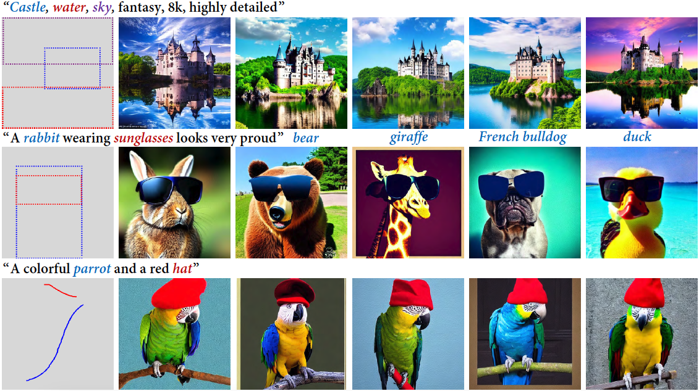

# BoxDiff: Text-to-Image Synthesis with Training-Free Box-Constrained Diffusion (ICCV 2023)

> Jinheng Xie, Yuexiang Li, Yawen Huang, Haozhe Liu, Wentian Zhang, Yefeng Zheng, Mike Zheng Shou 
> National University of Singapore, Tencent Jarvis Lab, KAUST
>
> Recent text-to-image diffusion models have demonstrated an astonishing capacity to generate high-quality images. However, researchers mainly studied the way of synthesizing images with only text prompts. While some works have explored using other modalities as conditions, considerable paired data, e.g., box/mask-image pairs, and fine-tuning time are required for nurturing models. As such paired data is time-consuming and labor-intensive to acquire and restricted to a closed set, this potentially becomes the bottleneck for applications in an open world. This paper focuses on the simplest form of user-provided conditions, e.g., box or scribble. To mitigate the aforementioned problem, we propose a training-free method to control objects and contexts in the synthesized images adhering to the given spatial conditions. Specifically, three spatial constraints, i.e., Inner-Box, Outer-Box, and Corner Constraints, are designed and seamlessly integrated into the denoising step of diffusion models, requiring no additional training and massive annotated layout data. Extensive results show that the proposed constraints can control what and where to present in the images while retaining the ability of the Stable Diffusion model to synthesize with high fidelity and diverse concept coverage.
> 
> **The paper is still being revised and you can refer to [Arxiv](https://arxiv.org/abs/2307.10816) for preview.**


### Setup
Note that we only test the code using PyTorch==1.12.0. You can build the environment via `pip` as follow: 
```
pip3 install -r requirements.txt
```
To apply BoxDiff on GLIGEN pipeline, please install diffusers as follow:
``` 
git clone git@github.com:gligen/diffusers.git
pip3 install -e .
```
 
### Usage
To add spatial control on the Stable Diffusion model, you can simply use `run_sd_boxdiff.py`. For example:
```
CUDA_VISIBLE_DEVICES=0 python3 run_sd_boxdiff.py --prompt "as the aurora lights up the sky, a herd of reindeer leisurely wanders on the grassy meadow, admiring the breathtaking view, a serene lake quietly reflects the magnificent display, and in the distance, a snow-capped mountain stands majestically, fantasy, 8k, highly detailed" --P 0.2 --L 1 --seeds [1,2,3,4,5,6,7,8,9,10,11,12,13,14,15,16,17,18,19,21,22,23,24,25,26,27,28,29,30] --token_indices [3,12,21,30,46] --bbox [[1,3,512,202],[75,344,421,495],[1,327,508,507],[2,217,507,341],[1,135,509,242]] --refine False
```
or another example:
``` 
CUDA_VISIBLE_DEVICES=0 python3 run_sd_boxdiff.py --prompt "A rabbit wearing sunglasses looks very proud"  --P 0.2 --L 1 --seeds [1,2,3,4,5,6,7,8,9] --token_indices [2,4] --bbox [[67,87,366,512],[66,130,364,262]]
```
Note that you can specify the token indices as the indices of words you want control in the text prompt and one token index has one corresponding conditoning box. `P` and `L` are hyper-parameters for the proposed constraints.

When `--bbox` is not specified, there is a interface to draw bounding boxes as conditions.
``` 
CUDA_VISIBLE_DEVICES=0 python3 run_sd_boxdiff.py --prompt "A rabbit wearing sunglasses looks very proud"  --P 0.2 --L 1 --seeds [1,2,3,4,5,6,7,8,9] --token_indices [2,4]
```

To add spatial control on the GLIGEN model, you can simply use `run_gligen_boxdiff.py`. For example:
``` 
CUDA_VISIBLE_DEVICES=0 python3 run_gligen_boxdiff.py --prompt "A rabbit wearing sunglasses looks very proud" --gligen_phrases ["a rabbit","sunglasses"] --P 0.2 --L 1 --seeds [1,2,3,4,5,6,7,8,9] --token_indices [2,4] --bbox [[67,87,366,512],[66,130,364,262]] --refine False
```

The direcory structure of synthetic results are as follows:
```
outputs/
|-- text prompt/
|   |-- 0.png 
|   |-- 0_canvas.png 
|   |-- 1.png
|   |-- 1_canvas.png 
|   |-- ...
```


Acknowledgment - the code is highly based on the repository of [diffusers](https://github.com/huggingface/diffusers), [google](https://github.com/google/prompt-to-prompt), and [yuval-alaluf](https://github.com/yuval-alaluf).